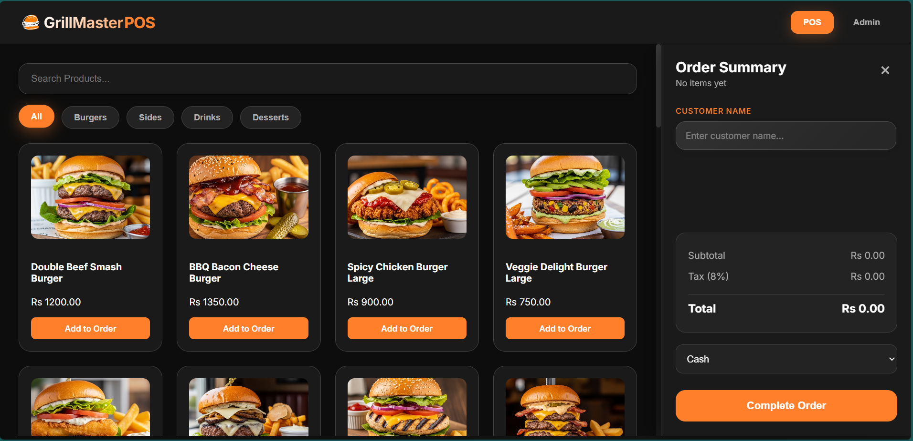
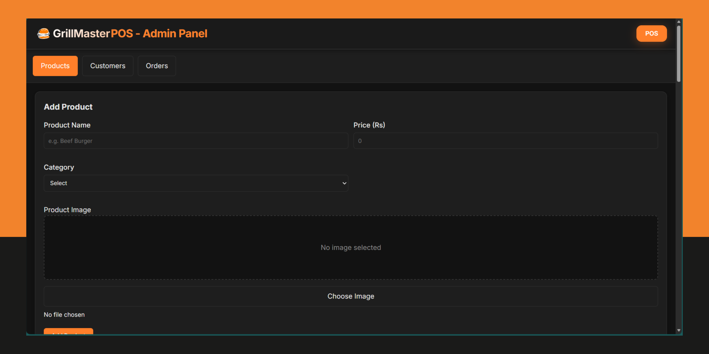

# GrillMaster POS

<p>
  
  
</p>

## Description

GrillMaster POS is a modern, browser-based Point of Sale system designed for restaurants and food service establishments. This single-page application provides an intuitive interface for managing menu items, processing customer orders, and tracking sales data in real-time.

## Features

* **Product Management**: Add, edit, and categorize menu items with images and pricing
* **Order Processing**: Streamlined order taking with table management
* **Sales Dashboard**: Real-time sales analytics and order history
* **Admin Panel**: Comprehensive system management and user controls
* **Local Data Storage**: Offline-capable with client-side data persistence
* **Responsive Design**: Works seamlessly across desktop and tablet devices

## Tech Stack

* **Frontend**: HTML5, CSS3, JavaScript (ES6+)
* **Storage**: localStorage (primary), IndexedDB (fallback for large files)
* **Styling**: Modern CSS with Flexbox/Grid layouts
* **Icons**: Font Awesome
* **Build Tools**: Native JavaScript (no framework dependencies)

## Project Structure

```
grillmaster-pos/
├── index.html                  # Main application entry point
├── css/
│   ├── styles.css              # Main stylesheet
│   └── responsive.css          # Responsive design rules
├── js/
│   ├── app.js                  # Core application logic
│   ├── products.js             # Product management module
│   ├── orders.js               # Order processing module
│   ├── admin.js                # Admin panel functionality
│   └── storage.js              # Data persistence layer
├── assets/
│   ├── images/                 # Product images and icons
│   └── uploads/                # User-uploaded images (if implemented)
└── docs/                       # Documentation
```

## Quick Start (Windows)

**Option 1:** Double-click the `index.html` file in Windows Explorer.

Access the system using the default admin credentials:

**Username:** `admin`
**Password:** `grillmaster123`

### Alternative Admin Access

```
Username: admin
Password: 123
```

### Steps

1. Extract the project files to your desired directory.
2. Launch the application by opening `index.html` in a web browser:

   ```cmd
   start index.html
   ```

---

## Data Storage & Image Handling

### Storage Limits

* **localStorage:** ~5–10MB depending on browser
* **IndexedDB:** Much larger (typically up to 50% of disk space)

### Image Storage Strategy

* Small thumbnails → stored in localStorage
* Large images → automatically stored in IndexedDB

### Resetting Storage

Execute this in the browser console to clear all saved data:

```javascript
localStorage.clear();
indexedDB.deleteDatabase('GrillMasterPOS');
console.log('All application data has been reset.');
```

---

## Usage

### Adding Products

1. Go to **Admin Panel > Products**
2. Click **Add New Product**
3. Fill in details (name, price, category)
4. Upload image (recommended < 2MB)
5. Save

### Taking Orders

* From dashboard → click **New Order**
* Select table number or **Takeaway**
* Add menu items & quantities
* Apply discounts
* Process payment & print receipt

### Viewing Orders

* **Active Orders:** Visible on main dashboard
* **Order History:** Admin Panel → Orders
* **Order ID Format:** `GMO-001`, `GMO-002` (sequential)

---

## Troubleshooting

### "Storage Quota Exceeded"

**Cause:** Large images exceeding localStorage limits
**Fix:** IndexedDB fallback happens automatically. Compress images to under 1MB.

### Login Failures

Reset admin credentials in console:

```javascript
localStorage.setItem('adminCredentials', JSON.stringify({
  username: 'admin',
  password: 'grillmaster123'
}));
```

### Order Not Processing

* Clear browser cache
* Reload application
* Check JavaScript console for errors

### Slow Performance

* Limit high-resolution product images
* Clear old order history

---

## Development Notes & Recommendations

### Security

* Add server-side authentication for production
* Encrypt sensitive data
* Implement input validation & XSS protection

### Scalability

* Use backend DB (MySQL/PostgreSQL) for multi-user setups
* Add REST API
* Add user role management

### Image Optimization

* Use client-side compression
* Prefer IndexedDB for all images
* Use cloud storage (AWS S3 / Firebase) for production

### Production Features

* Receipt printing integration
* Barcode scanning support
* Multi-terminal sync
* Backup/restore

---

## Contribution

1. Fork the repository
2. Create a feature branch:

   ```bash
   git checkout -b feature/improvement
   ```
3. Commit your changes:

   ```bash
   git commit -am "Add new feature"
   ```
4. Push the branch:

   ```bash
   git push origin feature/improvement
   ```
5. Create Pull Request

---

## License

MIT License — see the `LICENSE` file.

**MIT Summary:** Free permission to use, modify, distribute, and sell, as long as attribution is included.
